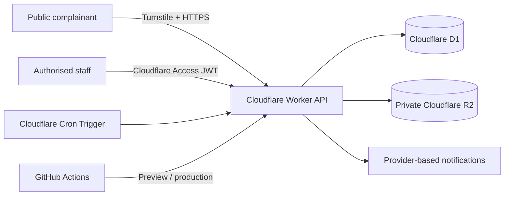

# Integrity Platform

This repository contains two complementary Integrity Department capabilities:

1. **Complaint Management System** — a Cloudflare-native, production-oriented case-management application in [`complaint-management/`](complaint-management/).
2. **Integrity Risk Modelling Lab** — the original Python/Streamlit synthetic procurement risk prototype retained at the repository root.

The Complaint Management System manages the full complaint lifecycle: secure intake, case registration, assessment, risk classification, assignment, investigation, evidence, sequential approval, outcome communication, corrective actions, closure, reopening, SLA monitoring, reporting, notifications, and immutable audit history.

## Architecture



The React single-page application and Hono API deploy as one Worker with Workers Static Assets. D1 and R2 are bound directly to the Worker; neither is public. Preview and production use separate Workers, D1 databases, R2 buckets, variables, and secrets.

Detailed design: [`docs/architecture.md`](docs/architecture.md).

## Technology stack

- React 19, TypeScript and Vite
- Hono Worker API
- Cloudflare Workers Static Assets
- Cloudflare D1 with version-controlled SQL migrations
- Cloudflare R2 for private evidence
- Cloudflare Turnstile for public abuse protection
- Cloudflare Access JWT validation for internal identity
- Cloudflare Cron Triggers for idempotent SLA evaluation
- Zod validation, Vitest, ESLint and TypeScript strict mode
- GitHub Actions with the official Wrangler action

## Main case-management features

- Public identified or anonymous complaint submission
- One-time secret tracking token and limited public status
- Concurrency-safe `CMP-YYYY-000001` Case IDs
- Structured preliminary assessment and risk classification
- Primary/supporting assignment and conflict declarations
- Investigation timeline, findings and related-case records
- Private R2 evidence with checksums, classification and audited access
- Versioned findings and sequential reviewer/management decisions
- Corrective-action ownership with independent verification
- Closure prerequisites and authorised reopening
- Risk/category-based SLAs and idempotent reminder stages
- Permission-filtered dashboards, search, CSV reporting and audit views
- Provider-based in-app and Microsoft Graph notifications

## Roles

- System Administrator
- Integrity Administrator
- Integrity Officer
- Case Officer / Investigator
- Reviewer / Head of Unit
- Management Approver
- Department Action Owner
- Auditor / Read-Only User

Every protected API action checks roles and case-level scope on the server. UI visibility is not an authorization control. See [`docs/user-roles.md`](docs/user-roles.md).

## Repository structure

```text
complaint-management/
  migrations/             D1 schema and reference data
  scripts/                deployment configuration preparation
  seed/                   preview-only synthetic users/data
  src/client/             responsive public and internal React UI
  src/shared/             shared roles, statuses and DTOs
  src/worker/             Worker API, auth, RBAC, workflow and cron
  test/                   unit, permission, API and abuse tests
docs/                     architecture, security and operations
.github/workflows/        CI, preview and production deployments
```

## Environment variables and secrets

Non-secret variables:

| Name | Purpose |
|---|---|
| `ENVIRONMENT` | `preview` or `production` |
| `APP_NAME` | User-facing application name |
| `TURNSTILE_SITE_KEY` | Environment-specific public site key |
| `MAX_UPLOAD_BYTES` | Maximum evidence object size |
| `ALLOWED_EMAIL_DOMAIN` | Internal identity domain |
| `NOTIFICATION_PROVIDER` | `in-app` or `microsoft-graph` |
| `TEAM_DOMAIN` | Cloudflare Access issuer/team URL |

Cloudflare/GitHub protected secrets:

- `TURNSTILE_SECRET_KEY`
- `CSRF_SECRET`
- `RATE_LIMIT_SALT`
- `ACCESS_AUD`
- `CLOUDFLARE_ACCOUNT_ID`
- `CLOUDFLARE_API_TOKEN`
- Optional `GRAPH_TENANT_ID`, `GRAPH_CLIENT_ID`, `GRAPH_CLIENT_SECRET`, `GRAPH_SENDER_EMAIL`

No real value belongs in Git. `.dev.vars` and `.env*` are ignored.

## D1 migrations

Migrations live in `complaint-management/migrations/` and are the schema source of truth. CI applies both migrations to a fresh local D1 database. Deployment workflows apply migrations to the environment database before deploying the Worker. Production never runs `seed/preview.sql`.

The schema includes foreign keys, constraints, indexes, soft-delete fields, immutable audit/status/approval triggers, and atomic sequence allocation. See [`docs/database-schema.md`](docs/database-schema.md).

## R2 evidence configuration

The Worker uses a private `EVIDENCE` binding. Object keys are random and separated by source (`public-submissions/` and `internal-evidence/`). Raw R2 URLs are never returned. Upload and download authorization happens inside the Worker, and every significant evidence action is audited. A malware-scanning integration point is explicit; production acceptance requires an approved scanner or quarantine process.

## Authentication and authorization

Cloudflare Access protects `/portal*` and `/api/internal/*`. The Worker independently validates the `Cf-Access-Jwt-Assertion` signature, issuer and audience, enforces the authorised email domain, resolves the internal user and roles from D1, applies case-level permissions, and requires a same-origin CSRF header on mutations.

Development bypass headers are compiled into the Worker but are rejected unless `DEV_AUTH_BYPASS=1` and `ENVIRONMENT` is not production.

## Notification provider

In-app notifications are always recorded with delivery state and idempotency keys. Email is behind an interface. When `NOTIFICATION_PROVIDER=microsoft-graph`, Graph credentials are read only from Worker secrets. Sensitive evidence is never attached to messages.

## Testing and verification

The CI workflow runs:

```text
pnpm install --frozen-lockfile
pnpm typecheck
pnpm lint
pnpm test
pnpm db:migrate:local
pnpm build
```

Tests cover workflow transitions, risk/SLA logic, Case ID concurrency, RBAC/case scope, upload validation, rate limiting, health/security headers, and unauthorised API rejection. The build includes a Wrangler dry-run bundle.

## Deployment architecture

- Pull requests deploy `integrity-complaints-preview` using preview D1/R2/Turnstile/Access configuration.
- `main` deploys `integrity-complaints-production` using production resources.
- GitHub environments hold scoped secrets and variables.
- Migrations execute before deployment; health verification executes after deployment.
- Production resources never receive preview seed data.

See [`docs/deployment.md`](docs/deployment.md).

## Backup and recovery

- Enable D1 Time Travel/bookmarks and document the recovery point before high-risk migrations.
- Apply least-privilege R2 retention/lifecycle policy and approved evidence-retention schedules.
- Export configuration and audit evidence through authorised operational procedures.
- Test restoration into an isolated non-production database and bucket.
- Never restore preview data into production or expose a restored R2 bucket publicly.

See [`docs/operations-guide.md`](docs/operations-guide.md).

## Known limitations

- Cloudflare Access policies, Turnstile widgets, D1 databases, R2 buckets, resource IDs and secrets are account-scoped and must exist before the GitHub deployment workflows can complete.
- Malware scanning is an integration interface, not a bundled scanning engine.
- Email delivery requires approved Microsoft Graph application permissions; in-app delivery works without it.
- The printable browser report and CSV export are implemented. Server-side PDF generation is intentionally deferred pending an approved Cloudflare-compatible PDF renderer.

## Original Integrity Risk Modelling Lab

The root Python application remains an open-source synthetic integrity-risk analytics prototype. It predicts review priority for synthetic procurement/payment transactions; it does not detect or prove misconduct. Its source, model artefacts, dataset and `requirements.txt` are unchanged by the case-management application.

## License

MIT. See [`LICENSE`](LICENSE).
