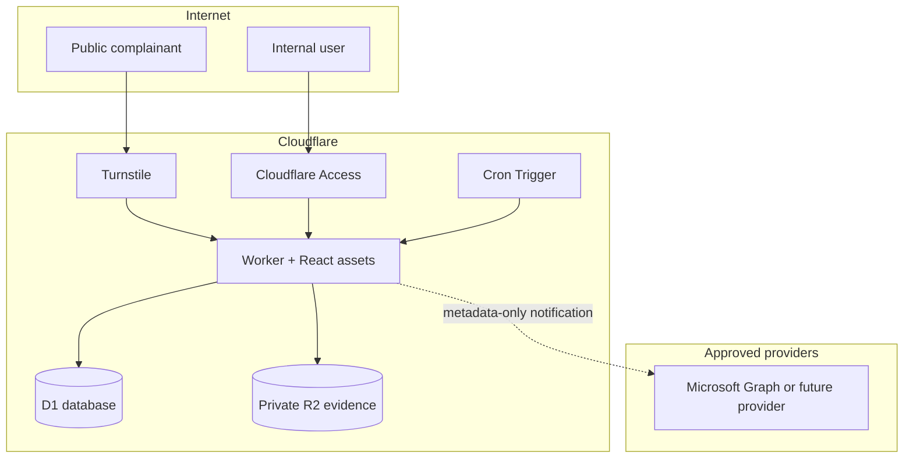
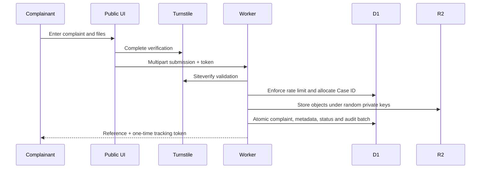
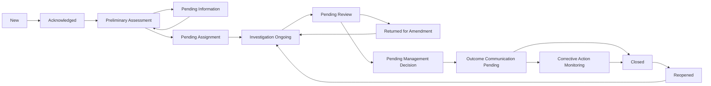
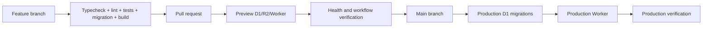

# Complaint Management System architecture

## Cloudflare architecture

The public and internal interfaces share one deployment but use separate route security. `/api/public/*` permits only narrow intake/tracking operations. `/portal*` and `/api/internal/*` are protected by Cloudflare Access at the edge and independently authenticated by the Worker.

## Component responsibilities

| Component | Responsibility |
|---|---|
| React client | Accessible workflows; no authorization decisions or confidential persistent storage |
| Worker API | Validation, authentication, RBAC, case scope, workflow, audit and safe responses |
| D1 | Relational case data, constraints, sequence allocation, audit and idempotency |
| R2 | Private evidence objects accessed only through authorized Worker routes |
| Turnstile | Human verification; every token is validated by Siteverify |
| Access | Organisation identity and edge enforcement for internal routes |
| Cron | Daily SLA evaluation and escalation events |
| Notification provider | In-app history; optional Microsoft Graph delivery |

## Complaint submission flow

## Internal case-management flow

Only domain actions create status changes. There is no generic “set status” endpoint.

## Deployment flow

