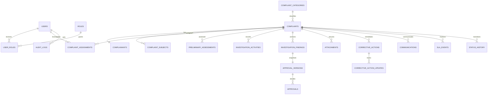

# Database schema

## Design principles

- D1/SQLite foreign keys are enabled.
- Public identifiers are independent of row identifiers.
- Operational concepts use relational tables and constraints.
- Mutable business records use soft deletion where retention applies.
- Audit, status history and approval decisions are immutable.
- Multi-step writes use D1 batches; status changes also use optimistic current-state checks.

## Entity map



## Tables

| Table | Purpose and critical constraints |
|---|---|
| `users`, `roles`, `user_roles` | Active internal identity and many-to-many RBAC |
| `complaint_categories` | Configurable intake classification |
| `sequence_counters` | Atomic per-year Case ID allocation |
| `complaints` | Case header, workflow, risk, SLA, outcome and closure |
| `complainants` | Contact/consent data separated from case operations |
| `complaint_subjects` | People/organisations complained against |
| `complaint_assignments` | Primary/supporting assignment history; one active primary |
| `preliminary_assessments` | Structured, versioned triage decisions |
| `investigation_activities` | Dated worklog with visibility and next action |
| `investigation_findings` | Immutable-submission versions and outcome |
| `attachments` | R2 metadata, checksum, source, classification and scan state |
| `approval_versions` | Snapshot reviewed at a specific version |
| `approvals` | Immutable sequential decisions and mandatory remarks |
| `corrective_actions`, `corrective_action_updates` | Ownership, progress and independent verification |
| `case_relationships` | Related, duplicate, parent and child cases |
| `communications` | Inbound/outbound/internal communication history |
| `notifications` | Provider state, retries, reads and idempotency |
| `sla_rules`, `sla_events`, `sla_extensions` | Targets, unique reminder stages and approved extensions |
| `status_history` | Immutable transition ledger |
| `audit_logs` | Immutable security/business audit |
| `application_settings` | Non-secret operational settings |
| `rate_limits` | Expiring hashed public-request buckets |

## Case ID generation

For each UTC year, the Worker inserts the counter row if absent, then executes one atomic statement:

```sql
UPDATE sequence_counters
SET next_value = next_value + 1
WHERE sequence_name = 'complaint_case' AND sequence_year = ?
RETURNING next_value - 1 AS allocated_value;
```

The returned number is formatted as `CMP-YYYY-000001`. Atomic updates and the unique `complaints.case_id` constraint prevent duplicates. Gaps are acceptable after failed intake; reuse is not.

## Indexing

Indexes cover status, risk, category, department, SLA due time, created time, title, active assignments, case activities, findings, approvals, action ownership, unread notifications, audit entity/user and status history. Search results are always combined with case-scope SQL.

## Retention

Soft-delete columns do not imply immediate erasure. Retention/legal-hold policy determines when complaint or evidence content may be removed. Audit, status and approval records cannot be updated or deleted by application/database users because triggers abort those operations.
