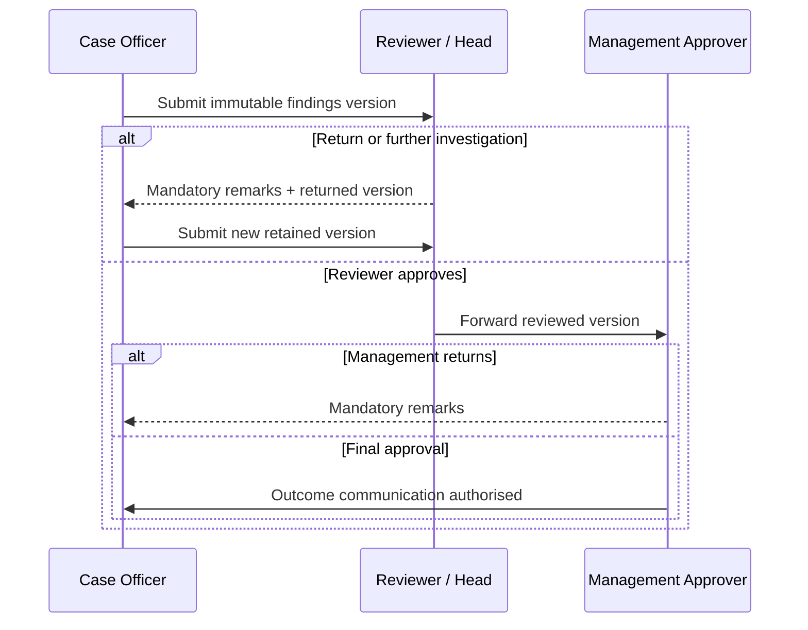
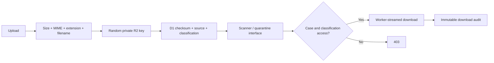
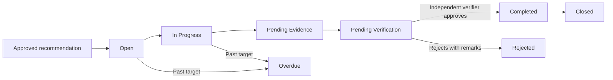

# Complaint workflows

## Public intake

1. Complainant selects Internal, External or Anonymous.
2. Required declarations, validation, Turnstile and rate limiting pass.
3. The Worker allocates a Case ID and public reference.
4. A 256-bit tracking token is displayed once; only its digest is stored.
5. Permitted files go to private R2 under random source-separated keys.
6. D1 records complaint, complainant, attachments, communication, status and audit.
7. The case enters Preliminary Assessment; public status remains Received.

## Preliminary assessment

The assessment records jurisdiction, sufficiency, duplicate/relationship checks, allegation indicators, seniority, evidence-destruction/immediate risks, assessor conflict, recommended risk, decision, reason and remarks. Assessor conflict blocks completion by that assessor.

Decision mapping:

| Decision | Controlled state |
|---|---|
| Proceed / escalate immediately | Pending Assignment |
| Request further information | Pending Information |
| Refer / outside jurisdiction / duplicate / no further action | Referred |

There is no arbitrary status update.

## Investigation and approval

Each decision stores approver, role, stage, remarks, time, reviewed version, return target and subsequent action. Editing/deleting a decision is prohibited.

## Evidence lifecycle

Public submission files remain `PUBLIC_SUBMISSION` until an authorised officer verifies/reclassifies them as internal evidence.

## Corrective action flow

The action owner cannot be the integrity verifier or closure approver. Database checks and API authorization both enforce this.

## Closure

Normal closure requires:

- management approval;
- approved findings and selected outcome;
- completed outcome communication;
- every corrective action closed/rejected or formally transferred;
- closure reason and date;
- an authorised management/integrity administrator.

Reopening records the reason, authorising officer, date and prior closure information before entering `Reopened`.

## SLA monitoring

Risk/category rules calculate due dates in business days. Daily Cron processing creates stages at seven days, three days, due date, and every third overdue day. A unique `(complaint, event type, stage)` constraint makes retries idempotent. Overdue stages escalate from case officer toward reviewer/management according to configuration.
